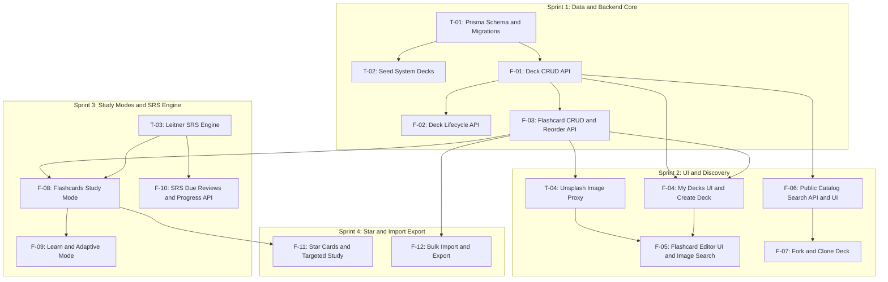

# 🏔️ Vocabulary & SRS — Full Scrum Decomposition

> **Source Spec:** [FEATURE-SPEC-vocabulary.md](file:///Users/ihor/Desktop/dash-stack/docs/specs/vocabulary/FEATURE-SPEC-vocabulary.md) (v1.4)  
> **Architecture Decision:** [ADR-001](file:///Users/ihor/Desktop/dash-stack/docs/specs/vocabulary/decisions/ADR-001-vocabulary-architecture.md)  
> **Created:** 2026-08-21  
> **Total Estimated Effort:** ~48 SP across 4 sprints

---

## Dependency Graph



### 🗺️ Visual Execution Roadmap (ASCII)

```text
[Sprint 1: Database & Backend API]
  T-01 (Prisma Schema) ──────► T-02 (System Seeds)
        │
        ├─────────────────────► F-01 (Deck CRUD API) ──────► F-02 (Lifecycle: Publish/Archive)
        │                             │
        └─────────────────────► F-03 (Flashcard CRUD API)
                                      │
 ┌────────────────────────────────────┴──────────────────────────────────────┐
 │                                                                           │
 ▼ [Sprint 2: UI & Explore]                                                  ▼ [Sprint 3: Study Modes & SRS]
 F-04 (My Decks UI) ◄─── F-01                                                T-03 (Leitner SRS Engine)
   │                                                                           │
   ├──► F-05 (Card Editor + Unsplash) ◄── T-04 (Image Proxy)                  ├──► F-08 (Flashcard Study Mode)
   │                                                                           │      │
 F-06 (Public Catalog) ──► F-07 (Fork Deck)                                    │      ├──► F-09 (Learn Mode)
                                                                               │      │
                                                                               │      └──► F-11 (Star Cards) [Sprint 4]
                                                                               ▼
                                                                             F-10 (Due Reviews API)
                                                                               │
                                                                               ▼ [Sprint 4: Utilities]
                                                                             F-12 (Bulk Import/Export)
```

---

## 🏔️ EPIC: Vocabulary & Spaced Repetition System

**Card Title:** `[EPIC] Vocabulary & Spaced Repetition System (SRS)`  
**Labels:** `🏔️ Epic`, `📄 Docs`  
**List:** `💡 Backlog`

```markdown
### 🏔️ Epic Overview & Business Goal
Build a decoupled, user-centric vocabulary learning and retention module
powered by the 5-Box Leitner spaced repetition algorithm. The system enables
any authenticated user to create flashcard decks with illustrative images,
study via 4 interactive modes (Flashcards, Learn, Test, Match), fork shared
decks, star difficult terms, and maintain daily SRS review streaks — all
independently of the LMS/Organization layer.

The module is the first major learning feature of the platform and directly
impacts daily active retention, the core engagement metric.

---

### 🎯 Key Goals (In-Scope)
- [ ] Personal deck management (CRUD, visibility, lifecycle states)
- [ ] Flashcard editor with Unsplash image search & bulk import/export
- [ ] 4 interactive study modes with minimum card constraints
- [ ] 5-Box Leitner SRS engine with daily due counter
- [ ] Public catalog discovery and deck forking
- [ ] Star cards for targeted practice
- [ ] Web Speech API audio pronunciation (client-side)
- [ ] Match game deck leaderboard
- [ ] System seed decks (Irregular Verbs, Oxford 3000, IT Terms)

---

### 🚫 Out of Scope
- AI-generated deck creation (Phase 2)
- FSRS-5 / SM-2 advanced algorithms (Phase 2)
- Audio file hosting on backend (Web Speech API only)
- LMS integration (CourseDeck / Task.deckId — separate spec)
- Practice Test Mode (Phase 1.5 — after core modes are stable)

---

### 🧩 Story & Task Decomposition

**Sprint 1 — Data Foundation & Deck Management:**
- [ ] `[TECH] T-01: Prisma Schema, Enums & Migrations for Vocabulary Module (3SP)`
- [ ] `[TECH] T-02: Seed Script for System Starter Decks (2SP)`
- [ ] `[FEAT] F-01: Deck CRUD API — Create, Read, Update, Delete (3SP)`
- [ ] `[FEAT] F-02: Deck Lifecycle API — Publish, Unpublish, Archive, Restore (2SP)`
- [ ] `[FEAT] F-03: Flashcard CRUD & Reorder API (3SP)`

**Sprint 2 — Deck UI, Flashcard Editor & Images:**
- [ ] `[TECH] T-04: Unsplash Image Search Proxy API (2SP)`
- [ ] `[FEAT] F-04: My Decks List Page & Create Deck Modal (3SP)`
- [ ] `[FEAT] F-05: Flashcard Editor UI with Image Search & Drag Reorder (5SP)`
- [ ] `[FEAT] F-06: Public Catalog Search API & Browse UI (3SP)`
- [ ] `[FEAT] F-07: Fork / Clone Deck — API & UI (2SP)`

**Sprint 3 — Study Modes & SRS Engine:**
- [ ] `[TECH] T-03: 5-Box Leitner SRS Calculation Engine (3SP)`
- [ ] `[FEAT] F-08: Flashcards Study Mode with Web Speech TTS (5SP)`
- [ ] `[FEAT] F-09: Learn / Adaptive Study Mode with MCQ Distractors (5SP)`
- [ ] `[FEAT] F-10: SRS Due Reviews Counter & Progress Submission API (3SP)`

**Sprint 4 — Star System, Import/Export & Polish:**
- [ ] `[FEAT] F-11: Star Cards & Targeted Study Filter (2SP)`
- [ ] `[FEAT] F-12: Bulk Import (TSV/CSV Paste) & Export (3SP)`

---

### 📚 Specifications & Architecture References
- **Feature Spec:** `docs/specs/vocabulary/FEATURE-SPEC-vocabulary.md` (v1.4)
- **ADR:** `docs/specs/vocabulary/decisions/ADR-001-vocabulary-architecture.md`
- **FUNCTIONAL-SPEC:** `docs/FUNCTIONAL-SPEC.md` (§3)
```

---

---

# Sprint 1 — Data Foundation & Deck Management API

> **Goal:** Build the entire data layer and core REST API so that all subsequent
> frontend and study-mode work has a stable, tested backend to build against.

---

## T-01: Prisma Schema, Enums & Migrations for Vocabulary Module

**Card Title:** `[TECH] Create Prisma Schema, Enums & Migrations for Vocabulary Module (3SP)`  
**Labels:** `⚙️ Tech Task`, `🛠️ Backend`, `🔥 High Priority`  
**List:** `📋 To Do` (Sprint 1)

```markdown
### ⚙️ Technical Goal & Context
Define the complete relational database structure for the Vocabulary & SRS
module in Prisma. This is the foundational task — every API endpoint, study
mode, and frontend feature depends on these models being correctly defined
with proper constraints, cascades, and indexes.

Models to create: `Deck`, `Flashcard`, `VocabProgress`, `DeckLeaderboard`.
Enums to create: `DeckVisibility`, `DeckStatus`, `DeckType`, `CEFRLevel`,
`VocabProgressStatus`.

---

### 📌 Prerequisites
- [x] Feature Spec approved (`docs/specs/vocabulary/FEATURE-SPEC-vocabulary.md` v1.4)
- [x] ADR-001 accepted (decoupled architecture)

---

### 📋 Acceptance Criteria
- [ ] All 4 models created in `prisma/schema.prisma` with field types matching
      §4.1–§4.4 of the Feature Spec exactly.
- [ ] Enums created: `DeckVisibility(PRIVATE, UNLISTED, PUBLIC)`,
      `DeckStatus(DRAFT, PUBLISHED, ARCHIVED)`, `DeckType(USER_GENERATED, SYSTEM)`,
      `CEFRLevel(A1, A2, B1, B2, C1, C2)`,
      `VocabProgressStatus(NEW, LEARNING, KNOWN, MASTERED, FORGOTTEN)`.
- [ ] Cascade delete configured:
  - Deleting a `Deck` cascades to `Flashcard`, `VocabProgress`, `DeckLeaderboard`.
  - Deleting a `Flashcard` cascades to `VocabProgress`.
- [ ] Composite unique constraint: `@@unique([userId, deckId, flashcardId])` on `VocabProgress`.
- [ ] Indexes created:
  - `VocabProgress`: `@@index([userId, nextReviewAt])`, `@@index([deckId])`
  - `DeckLeaderboard`: `@@index([deckId, durationMs])`
  - `Deck`: `@@index([ownerUserId])`, `@@index([visibility, status])`
  - `Flashcard`: `@@index([deckId, position])`
- [ ] `Deck.slug` has `@unique` constraint.
- [ ] `Deck` has a self-relation for `forkedFromDeckId` (optional, nullable).
- [ ] `User` model updated with reverse relations: `decks`, `vocabProgress`, `deckLeaderboardEntries`.
- [ ] Migration applies cleanly: `npx prisma migrate dev --name add_vocabulary_module`.
- [ ] Prisma Client regenerated with strict TypeScript types.
- [ ] Zero regressions on existing models (User, Organization, Task, etc.).

---

### 🛠️ Implementation Plan
- [ ] Add 5 new enums to `prisma/schema.prisma`
- [ ] Add `Deck` model with all fields, relations, and indexes
- [ ] Add `Flashcard` model with `onDelete: Cascade` to Deck
- [ ] Add `VocabProgress` model with composite unique + indexes
- [ ] Add `DeckLeaderboard` model with cascade + index
- [ ] Add reverse relations to existing `User` model
- [ ] Run `npx prisma migrate dev --name add_vocabulary_module`
- [ ] Run `npx prisma generate` and verify generated types
- [ ] Run full backend test suite to ensure zero regressions

---

### 📚 Tech Details & References
- **Target File:** `backend/prisma/schema.prisma`
- **Migration Output:** `backend/prisma/migrations/YYYYMMDDHHMMSS_add_vocabulary_module/`
- **Spec Reference:** `docs/specs/vocabulary/FEATURE-SPEC-vocabulary.md` §4
- **Existing Pattern:** Follow `Task`, `Checklist`, `ChecklistItem` cascade pattern
```

---

## T-02: Seed Script for System Starter Decks

**Card Title:** `[TECH] Create Seed Script for System Starter Decks with Sample Flashcards (2SP)`  
**Labels:** `⚙️ Tech Task`, `🛠️ Backend`  
**List:** `📋 To Do` (Sprint 1)

```markdown
### ⚙️ Technical Goal & Context
Create a Prisma seed script that populates the database with 4 official
system decks so that the public catalog is not empty on first launch. These
decks serve as both test data for development and starter content for new users.

System decks are owned by a designated system user account and are always
`type: SYSTEM`, `visibility: PUBLIC`, `status: PUBLISHED`.

---

### 📌 Prerequisites
- [ ] T-01 merged (Prisma schema with Deck, Flashcard models)

---

### 📋 Acceptance Criteria
- [ ] 4 system decks created on `prisma db seed`:
  1. **Top 100 Irregular Verbs** (A1–B1) — min 20 sample cards
  2. **Oxford 3000 Starter** (A1) — min 20 sample cards
  3. **Oxford 3000 Elementary** (A2) — min 20 sample cards
  4. **Essential IT & Software Terms** (B1–B2) — min 20 sample cards
- [ ] Each deck has `type: SYSTEM`, `visibility: PUBLIC`, `status: PUBLISHED`.
- [ ] Each flashcard has `term`, `definition`, `example` populated (no empty fields).
- [ ] Seed is idempotent: running twice does not create duplicates (upsert by slug).
- [ ] `package.json` has `"prisma": { "seed": "ts-node prisma/seed.ts" }`.

---

### 🛠️ Implementation Plan
- [ ] Create `backend/prisma/seed/vocabulary-data.ts` with flashcard arrays
- [ ] Create or update `backend/prisma/seed.ts` with upsert logic
- [ ] Create a system user account constant (or use first ADMIN user)
- [ ] Test with `npx prisma db seed` on fresh and existing databases
- [ ] Verify cards visible in DB via Prisma Studio

---

### 📚 Tech Details & References
- **Target Files:** `backend/prisma/seed.ts`, `backend/prisma/seed/vocabulary-data.ts`
- **Spec Reference:** §11.2
```

---

## F-01: Deck CRUD API — Create, Read, Update, Delete

**Card Title:** `[FEAT] Implement Deck CRUD REST API — Create, List, Get, Update, Delete (3SP)`  
**Labels:** `✨ Feature`, `🛠️ Backend`, `🔥 High Priority`  
**List:** `📋 To Do` (Sprint 1)

```markdown
### 🎯 User Story / Goal
As an **authenticated user**,  
I want to **create, view, edit, and delete my vocabulary decks via REST API**,  
so that **I can manage my personal flashcard collections programmatically
before the UI is built**.

---

### 📌 Prerequisites
- [ ] T-01 merged (Prisma schema)

---

### ⚙️ Requirements & API Contracts

**POST /api/v1/vocab/decks** — Create Deck
- Auth: Required (JWT Bearer)
- Body:
  ```json
  {
    "title": "string (1–100 chars, required)",
    "description": "string (optional)",
    "language": "string (default: 'en')",
    "level": "A1 | A2 | B1 | B2 | C1 | C2 (optional)",
    "tags": ["string"] (optional),
    "visibility": "PRIVATE | UNLISTED | PUBLIC (default: PRIVATE)"
  }
  ```
- Response `201 Created`: Full Deck object with `id`, `slug`, `status: DRAFT`
- `ownerUserId` set from JWT, never from body.
- `slug` auto-generated from title via slugify (with uniqueness suffix if collision).

**GET /api/v1/vocab/decks** — List My Decks
- Auth: Required
- Query: `?status=DRAFT|PUBLISHED|ARCHIVED` (optional filter)
- Response `200 OK`: Array of Deck objects with computed `cardCount` via `_count`.
- Returns ONLY decks where `ownerUserId = currentUser.id`.

**GET /api/v1/vocab/decks/:id** — Get Deck Details
- Auth: Optional (visibility rules apply per §9 permission matrix)
- Response `200 OK`: Deck + nested `flashcards[]` ordered by `position`.
- `404` if deck is PRIVATE and requester is not the owner.

**PATCH /api/v1/vocab/decks/:id** — Update Deck Metadata
- Auth: Required, owner or Admin only
- Body: Partial deck fields (title, description, tags, visibility, language, level)
- `403` if requester is not owner and not Admin.

**DELETE /api/v1/vocab/decks/:id** — Delete Deck
- Auth: Required, owner or Admin only
- Cascade deletes all Flashcards, VocabProgress, DeckLeaderboard entries.
- Response `204 No Content`.

---

### 📋 Acceptance Criteria
- [ ] `POST /decks` with valid body returns `201` with new Deck in `DRAFT` status.
- [ ] `POST /decks` with empty title returns `400` with validation error message.
- [ ] `POST /decks` with title > 100 chars returns `400`.
- [ ] `GET /decks` returns only the authenticated user's decks, with accurate `cardCount`.
- [ ] `GET /decks/:id` for a PUBLIC deck is accessible by any user.
- [ ] `GET /decks/:id` for a PRIVATE deck returns `404` to non-owners.
- [ ] `GET /decks/:id` for an UNLISTED deck is accessible via direct link by any user.
- [ ] `PATCH /decks/:id` by non-owner returns `403 Forbidden`.
- [ ] `DELETE /decks/:id` cascades and removes all child records (verified in DB).
- [ ] `slug` is unique; duplicate titles get a numeric suffix (e.g. `my-deck-2`).
- [ ] Unauthenticated requests to all endpoints return `401 Unauthorized`.

---

### 🛠️ Technical Tasks
- [ ] Create NestJS module: `backend/src/vocab/vocab.module.ts`
- [ ] **Domain Layer:**
  - [ ] `domain/enums/` — re-export Prisma enums or create domain enums
  - [ ] `domain/exceptions/` — `DeckNotFoundException`, `DeckForbiddenException`
  - [ ] `domain/policies/deck-visibility.policy.ts` — visibility access logic
- [ ] **Application Layer:**
  - [ ] `application/commands/create-deck.command.ts`
  - [ ] `application/commands/update-deck.command.ts`
  - [ ] `application/use-cases/create-deck.use-case.ts`
  - [ ] `application/use-cases/find-all-user-decks.use-case.ts`
  - [ ] `application/use-cases/find-deck-by-id.use-case.ts`
  - [ ] `application/use-cases/update-deck.use-case.ts`
  - [ ] `application/use-cases/delete-deck.use-case.ts`
  - [ ] `application/ports/deck.repository.port.ts`
  - [ ] `application/read-models/deck.read-model.ts`
- [ ] **Infrastructure Layer:**
  - [ ] `infrastructure/persistence/prisma-deck.repository.ts`
  - [ ] `infrastructure/persistence/prisma-deck.mapper.ts`
  - [ ] `infrastructure/utils/slugify.ts` — slug generation with collision handling
- [ ] **Presentation Layer:**
  - [ ] `presentation/deck.controller.ts` — all 5 endpoints
  - [ ] `presentation/dto/create-deck.dto.ts` — class-validator decorators
  - [ ] `presentation/dto/update-deck.dto.ts`
  - [ ] `presentation/dto/find-user-decks.dto.ts` — query params DTO
- [ ] **Tests:**
  - [ ] Unit tests for `create-deck.use-case`, `deck-visibility.policy`
  - [ ] Unit test for `slugify` utility with collision handling

---

### 📚 Tech Details & References
- **Module Root:** `backend/src/vocab/`
- **Architecture Pattern:** Clean Architecture (matching `backend/src/task/` structure)
- **Database Models:** `Deck` in `prisma/schema.prisma`
- **Spec Reference:** FR-VOCAB-001 (§6), API Contract (§7.1)
```

---

## F-02: Deck Lifecycle API — Publish, Unpublish, Archive, Restore

**Card Title:** `[FEAT] Implement Deck Lifecycle State Transitions — Publish, Unpublish, Archive, Restore (2SP)`  
**Labels:** `✨ Feature`, `🛠️ Backend`  
**List:** `📋 To Do` (Sprint 1)

```markdown
### 🎯 User Story / Goal
As a **deck owner**,  
I want to **publish my deck to make it discoverable, archive old decks, and
restore them later**,  
so that **I control the lifecycle of my study materials with clear state transitions**.

---

### 📌 Prerequisites
- [ ] F-01 merged (Deck CRUD API with base controller)

---

### ⚙️ Requirements & API Contracts

State transitions are triggered via `PATCH /api/v1/vocab/decks/:id` with
a `status` field. The backend enforces the state machine from §5.1:

```
DRAFT -> PUBLISHED  (requires cardCount >= 2)
PUBLISHED -> DRAFT  (unpublish)
PUBLISHED -> ARCHIVED
ARCHIVED -> DRAFT   (restore)
```

- **Invalid transitions** (e.g. `DRAFT -> ARCHIVED`) return `400 Bad Request`.
- **Publish without enough cards** returns `400 Bad Request` with message
  `"Cannot publish: deck must have at least 2 flashcards"`.

---

### 📋 Acceptance Criteria
- [ ] **Scenario 1 (Publish Success):**
  - **Given** a DRAFT deck with 5 flashcards
  - **When** owner sends `PATCH /decks/:id { "status": "PUBLISHED" }`
  - **Then** deck status becomes `PUBLISHED` and is discoverable in public catalog.

- [ ] **Scenario 2 (Publish Blocked — Insufficient Cards):**
  - **Given** a DRAFT deck with 1 flashcard
  - **When** owner attempts to publish
  - **Then** API returns `400` with `"minimum 2 cards required"`.

- [ ] **Scenario 3 (Invalid Transition):**
  - **Given** a DRAFT deck
  - **When** owner sends `PATCH { "status": "ARCHIVED" }`
  - **Then** API returns `400` with `"Invalid state transition: DRAFT -> ARCHIVED"`.

- [ ] **Scenario 4 (Archive & Restore):**
  - **Given** a PUBLISHED deck
  - **When** owner archives it, then restores it
  - **Then** deck returns to DRAFT status.

---

### 🛠️ Technical Tasks
- [ ] Create `domain/policies/deck-status.policy.ts` — state machine with
      allowed transitions map and `canTransition(from, to)` method
- [ ] Create `application/use-cases/transition-deck-status.use-case.ts`
- [ ] Add cardCount check in publish transition (query `_count`)
- [ ] Add validation in `update-deck.use-case.ts` to delegate status changes
      to the policy
- [ ] Unit tests for all 6 transition paths (4 valid + 2 invalid)

---

### 📚 Tech Details & References
- **Target Files:** `backend/src/vocab/domain/policies/deck-status.policy.ts`
- **Spec Reference:** §5.1 (State Machine)
```

---

## F-03: Flashcard CRUD & Reorder API

**Card Title:** `[FEAT] Implement Flashcard CRUD & Bulk Reorder REST API (3SP)`  
**Labels:** `✨ Feature`, `🛠️ Backend`, `🔥 High Priority`  
**List:** `📋 To Do` (Sprint 1)

```markdown
### 🎯 User Story / Goal
As a **deck owner**,  
I want to **add, edit, delete, and reorder flashcards within my deck via REST API**,  
so that **I can build and organize my vocabulary study material**.

---

### 📌 Prerequisites
- [ ] F-01 merged (Deck CRUD API — need deck existence and ownership checks)

---

### ⚙️ Requirements & API Contracts

**POST /api/v1/vocab/decks/:deckId/cards** — Add Card(s)
- Auth: Deck owner or Admin only
- Body (single):
  ```json
  {
    "term": "string (1–255 chars, required)",
    "definition": "string (1–1000 chars, required)",
    "example": "string (optional, max 500 chars)",
    "imageUrl": "string (optional, valid URL)"
  }
  ```
- Body (bulk): `{ "cards": [{ term, definition, ... }, ...] }`
- `position` auto-assigned: `MAX(position) + 1` for single, sequential for bulk.
- Response `201 Created`: Created card(s).

**PATCH /api/v1/vocab/decks/:deckId/cards/:cardId** — Update Card
- Auth: Deck owner or Admin only
- Body: Partial fields (term, definition, example, imageUrl)
- `403` if requester does not own the deck.

**DELETE /api/v1/vocab/decks/:deckId/cards/:cardId** — Delete Card
- Auth: Deck owner or Admin only
- Cascade deletes associated `VocabProgress` records.
- Response `204 No Content`.

**PUT /api/v1/vocab/decks/:deckId/cards/order** — Reorder Cards
- Auth: Deck owner or Admin only
- Body: `{ "cardIds": ["id3", "id1", "id2"] }` — new order as array.
- Validates: all IDs belong to the deck; no missing/extra IDs.
- Updates `position` field atomically in a transaction.

---

### 📋 Acceptance Criteria
- [ ] Adding a card to a deck with 5 cards sets `position = 6`.
- [ ] Bulk add of 10 cards creates 10 records with positions 1–10 (on empty deck).
- [ ] `term` or `definition` missing returns `400` with field-level validation error.
- [ ] `term` > 255 chars or `definition` > 1000 chars returns `400`.
- [ ] Non-owner attempting any card mutation returns `403 Forbidden`.
- [ ] Deleting a card cascades and removes all `VocabProgress` for that card.
- [ ] Reorder with `[C3, C1, C2]` updates positions to `C3=0, C1=1, C2=2`.
- [ ] Reorder with missing or extra card IDs returns `400`.
- [ ] Reorder runs atomically inside `prisma.$transaction`.

---

### 🛠️ Technical Tasks
- [ ] **Application Layer:**
  - [ ] `application/use-cases/add-flashcard.use-case.ts`
  - [ ] `application/use-cases/add-flashcards-bulk.use-case.ts`
  - [ ] `application/use-cases/update-flashcard.use-case.ts`
  - [ ] `application/use-cases/delete-flashcard.use-case.ts`
  - [ ] `application/use-cases/reorder-flashcards.use-case.ts`
  - [ ] `application/ports/flashcard.repository.port.ts`
- [ ] **Infrastructure Layer:**
  - [ ] `infrastructure/persistence/prisma-flashcard.repository.ts`
  - [ ] `infrastructure/persistence/prisma-flashcard.mapper.ts`
- [ ] **Presentation Layer:**
  - [ ] `presentation/flashcard.controller.ts` — 4 endpoints
  - [ ] `presentation/dto/create-flashcard.dto.ts`
  - [ ] `presentation/dto/update-flashcard.dto.ts`
  - [ ] `presentation/dto/reorder-flashcards.dto.ts`
- [ ] **Domain:**
  - [ ] `domain/exceptions/flashcard-not-found.exception.ts`
- [ ] **Tests:**
  - [ ] Unit tests for add (single + bulk), reorder validation
  - [ ] Unit test: position auto-assignment logic

---

### 📚 Tech Details & References
- **Module Root:** `backend/src/vocab/`
- **Spec Reference:** FR-VOCAB-002 (§6), API Contract (§7.1)
- **Key Constraint:** Flashcard belongs to exactly one Deck (1-to-N)
```

---

---

# Sprint 2 — Deck UI, Flashcard Editor & Public Catalog

> **Goal:** Build the frontend for deck management, flashcard editing with
> Unsplash image search, public catalog discovery, and deck forking.

---

## T-04: Unsplash Image Search Proxy API

**Card Title:** `[TECH] Implement Unsplash Image Search Proxy API Endpoint (2SP)`  
**Labels:** `⚙️ Tech Task`, `🛠️ Backend`  
**List:** `📋 To Do` (Sprint 2)

```markdown
### ⚙️ Technical Goal & Context
Create a backend proxy endpoint for Unsplash API image search. The proxy
is necessary to: (1) keep the Unsplash API key server-side only, (2) add
server-side caching to reduce API calls, (3) normalize the response
format for the frontend.

---

### 📌 Prerequisites
- [ ] `UNSPLASH_ACCESS_KEY` environment variable configured in `.env`

---

### ⚙️ Requirements & API Contracts

**GET /api/v1/vocab/images/search**
- Auth: Required (deck owner context)
- Query: `?q=butterfly&page=1&perPage=12`
- Response `200 OK`:
  ```json
  {
    "results": [
      {
        "id": "unsplash_photo_id",
        "thumbnailUrl": "https://images.unsplash.com/...?w=200&q=80",
        "previewUrl": "https://images.unsplash.com/...?w=400&q=80",
        "fullUrl": "https://images.unsplash.com/...?w=800&q=80",
        "alt": "description",
        "authorName": "John Doe",
        "authorUrl": "https://unsplash.com/@johndoe"
      }
    ],
    "totalPages": 5
  }
  ```
- Response `502 Bad Gateway` if Unsplash API is down or rate-limited.

---

### 📋 Acceptance Criteria
- [ ] `GET /images/search?q=cat` returns 12 image results with valid URLs.
- [ ] Query with empty `q` returns `400 Bad Request`.
- [ ] Unsplash API key is NEVER exposed in the response or frontend bundle.
- [ ] Response includes `authorName` and `authorUrl` (Unsplash attribution requirement).
- [ ] If Unsplash API returns 429 (rate limit), our API returns `502` with
      `"Image search temporarily unavailable"`.
- [ ] Images are requested at thumbnail size (`w=200`) and preview size (`w=400`)
      to minimize bandwidth.

---

### 🛠️ Implementation Plan
- [ ] Add `UNSPLASH_ACCESS_KEY` to `backend/.env.example`
- [ ] Create `backend/src/vocab/infrastructure/external/unsplash.service.ts`
  - HTTP client (Axios/fetch) with 5s timeout
  - Response mapping to normalized `ImageSearchResult` type
  - Error handling for 429, 500, network failures
- [ ] Create `presentation/image-search.controller.ts` with `GET /images/search`
- [ ] Create `presentation/dto/image-search.dto.ts` (query validation)
- [ ] Integration test with mocked Unsplash responses

---

### 📚 Tech Details & References
- **Unsplash API Docs:** https://unsplash.com/documentation#search-photos
- **Rate Limit:** 50 requests/hour (free tier) — consider in-memory cache (5 min TTL)
- **Spec Reference:** FR-VOCAB-006, §2.1 (Image Provider dependency)
```

---

## F-04: My Decks List Page & Create Deck Modal

**Card Title:** `[FEAT] Build My Decks List Page with Create Deck Modal & Status Badges (3SP)`  
**Labels:** `✨ Feature`, `🎨 Frontend`  
**List:** `📋 To Do` (Sprint 2)

```markdown
### 🎯 User Story / Goal
As an **authenticated user**,  
I want to **see all my vocabulary decks on a dedicated page with card counts
and status badges, and create new decks via a modal form**,  
so that **I can manage my flashcard collections at a glance**.

---

### 📌 Prerequisites
- [ ] F-01 merged (Deck CRUD API)
- [ ] F-03 merged (Flashcard API — needed for cardCount)

---

### 📋 Acceptance Criteria
- [ ] `/vocabulary` route displays a grid/list of user's decks.
- [ ] Each deck card shows: title, description snippet, cardCount, CEFR level
      badge, visibility icon, status badge (Draft/Published/Archived).
- [ ] "Create Deck" button opens a modal with fields: Title (required), Description,
      Level (select), Tags (multi-input), Visibility (radio group).
- [ ] On successful creation, the new deck appears in the list without page reload
      (optimistic update or cache invalidation).
- [ ] Validation errors from the API are displayed inline in the modal form.
- [ ] Empty state: when user has 0 decks, display an illustration with CTA
      "Create your first deck".
- [ ] Skeleton loading state shown while deck list is fetching.
- [ ] Deck cards are clickable — navigate to `/vocabulary/:id` (deck detail).

---

### 🛠️ Technical Tasks
- [ ] **App Router:**
  - [ ] Create route `frontend/src/app/(dashboard)/vocabulary/page.tsx`
  - [ ] Create route `frontend/src/app/(dashboard)/vocabulary/[id]/page.tsx` (placeholder)
- [ ] **FSD Entities Layer:**
  - [ ] `frontend/src/entities/deck/model/types.ts` — Deck TypeScript type
  - [ ] `frontend/src/entities/deck/api/queries.ts` — `useMyDecks()` React Query hook
  - [ ] `frontend/src/entities/deck/ui/DeckCard.tsx` — card component with badges
- [ ] **FSD Features Layer:**
  - [ ] `frontend/src/features/create-deck/ui/CreateDeckModal.tsx`
  - [ ] `frontend/src/features/create-deck/api/actions.ts` — `useCreateDeck()` mutation
  - [ ] `frontend/src/features/create-deck/model/schema.ts` — Zod validation schema
- [ ] **FSD Views Layer:**
  - [ ] `frontend/src/views/vocabulary/ui/VocabularyListView.tsx`
- [ ] **Sidebar Navigation:**
  - [ ] Add "Vocabulary" link to dashboard sidebar widget

---

### 📚 Tech Details & References
- **API:** `GET /api/v1/vocab/decks`, `POST /api/v1/vocab/decks`
- **FSD Pattern:** Follow `features/manage-task/` structure
- **Spec Reference:** FR-VOCAB-001
```

---

## F-05: Flashcard Editor UI with Image Search & Drag Reorder

**Card Title:** `[FEAT] Build Flashcard Editor Page with Unsplash Image Search & Drag-and-Drop Reorder (5SP)`  
**Labels:** `✨ Feature`, `🎨 Frontend`, `🛠️ Backend`  
**List:** `📋 To Do` (Sprint 2)

```markdown
### 🎯 User Story / Goal
As a **deck owner**,  
I want to **add and edit flashcards with terms, definitions, examples, and
images in an inline editor, and reorder them via drag-and-drop**,  
so that **I can efficiently build rich study material with visual associations**.

---

### 📌 Prerequisites
- [ ] F-03 merged (Flashcard CRUD & Reorder API)
- [ ] T-04 merged (Unsplash Image Search Proxy)
- [ ] F-04 merged (deck detail route exists)

---

### 📋 Acceptance Criteria
- [ ] `/vocabulary/:id` shows a deck header (title, description, metadata) and
      a scrollable list of flashcard rows in position order.
- [ ] Each card row has inline editable fields: Term, Definition, Example.
- [ ] Clicking the image icon on a card row opens an Unsplash search popover
      pre-filled with the card's term as query.
- [ ] Image search popover shows a 3x4 grid of thumbnail results.
- [ ] Clicking a thumbnail attaches the image URL to the card (saves immediately).
- [ ] "Remove Image" button clears the `imageUrl` on the card.
- [ ] Drag handle on each row allows reordering. Dropping triggers `PUT /cards/order`.
- [ ] "+ Add Card" button at the bottom appends a new empty row.
- [ ] Unsaved changes in a card row are auto-saved on blur (debounced 500ms) or
      preserved in `localStorage` if the page is interrupted.
- [ ] Cards list uses virtualized scrolling for decks with > 50 cards.
- [ ] If Unsplash API returns `502`, the popover shows a friendly fallback message
      ("Image search unavailable, try again later").

---

### 🛠️ Technical Tasks
- [ ] **FSD Features Layer:**
  - [ ] `frontend/src/features/manage-flashcard/ui/FlashcardEditor.tsx` — main editor
  - [ ] `frontend/src/features/manage-flashcard/ui/FlashcardRow.tsx` — single card row
  - [ ] `frontend/src/features/manage-flashcard/ui/ImageSearchPopover.tsx` — Unsplash gallery
  - [ ] `frontend/src/features/manage-flashcard/api/queries.ts` — `useDeckFlashcards()`
  - [ ] `frontend/src/features/manage-flashcard/api/actions.ts` — mutations (add, update, delete, reorder)
  - [ ] `frontend/src/features/manage-flashcard/model/schema.ts` — Zod schemas
- [ ] **FSD Views Layer:**
  - [ ] `frontend/src/views/vocabulary-detail/ui/VocabularyDetailView.tsx` — deck detail page
- [ ] **Shared UI:**
  - [ ] Drag-and-drop integration (dnd-kit or @hello-pangea/dnd)
  - [ ] Debounced auto-save hook (`useDebounceCallback`)
- [ ] **Tests:**
  - [ ] Component test: FlashcardRow renders all fields
  - [ ] Component test: ImageSearchPopover shows results

---

### 📚 Tech Details & References
- **API:** `POST/PATCH/DELETE /decks/:id/cards/...`, `PUT /cards/order`, `GET /images/search`
- **Virtualization:** Consider `@tanstack/react-virtual` for large decks
- **Spec Reference:** FR-VOCAB-002, FR-VOCAB-006
```

---

## F-06: Public Catalog Search API & Browse UI

**Card Title:** `[FEAT] Implement Public Deck Catalog Search API & Browse Page with Filters (3SP)`  
**Labels:** `✨ Feature`, `🎨 Frontend`, `🛠️ Backend`  
**List:** `📋 To Do` (Sprint 2)

```markdown
### 🎯 User Story / Goal
As a **learner (including unauthenticated guests)**,  
I want to **search and browse public vocabulary decks by keyword, CEFR level,
and tags with pagination**,  
so that **I can find existing study material without creating my own**.

---

### 📌 Prerequisites
- [ ] F-01 merged (Deck model + base repository)

---

### ⚙️ Requirements & API Contracts

**GET /api/v1/vocab/decks/public**
- Auth: Optional (guest-accessible)
- Query: `?q=irregular+verbs&level=B1&tags=grammar&page=1&limit=12`
- Response `200 OK`:
  ```json
  {
    "data": [
      {
        "id": "...",
        "title": "...",
        "description": "...",
        "level": "B1",
        "tags": ["grammar"],
        "cardCount": 42,
        "owner": { "id": "...", "firstName": "...", "avatar": "..." }
      }
    ],
    "meta": { "total": 156, "page": 1, "limit": 12, "totalPages": 13 }
  }
  ```
- Filters: `q` searches `title`, `description`, and `tags` (case-insensitive).
- **Only returns** decks with `visibility = PUBLIC` AND `status = PUBLISHED`.

---

### 📋 Acceptance Criteria
- [ ] PRIVATE and UNLISTED decks NEVER appear in results regardless of query.
- [ ] DRAFT decks with `visibility = PUBLIC` do NOT appear in results.
- [ ] Search by title substring returns matching decks (case-insensitive).
- [ ] Level filter returns only decks with matching CEFR level.
- [ ] Pagination works correctly: `page=2, limit=12` returns items 13–24.
- [ ] Response includes `cardCount` and owner avatar/name.
- [ ] Browse page at `/vocabulary/explore` shows a search bar, level filter chips,
      and a responsive grid of deck preview cards.
- [ ] Empty results show a "No decks found" illustration.

---

### 🛠️ Technical Tasks
- [ ] **Backend:**
  - [ ] `application/use-cases/search-public-decks.use-case.ts`
  - [ ] `infrastructure/persistence/prisma-deck.repository.ts` — add `findPublic()` method
      with Prisma `where: { visibility: PUBLIC, status: PUBLISHED }` and text search
  - [ ] `presentation/dto/search-public-decks.dto.ts` — query params validation
  - [ ] Add endpoint to `deck.controller.ts`
- [ ] **Frontend:**
  - [ ] Route: `frontend/src/app/(dashboard)/vocabulary/explore/page.tsx`
  - [ ] `frontend/src/features/explore-decks/ui/ExploreDecksView.tsx`
  - [ ] `frontend/src/features/explore-decks/ui/DeckSearchBar.tsx`
  - [ ] `frontend/src/features/explore-decks/ui/LevelFilterChips.tsx`
  - [ ] `frontend/src/features/explore-decks/api/queries.ts` — `usePublicDecks()` with search params
- [ ] **Tests:**
  - [ ] Unit test: repository method correctly filters by visibility+status
  - [ ] Unit test: search query matches title and tags

---

### 📚 Tech Details & References
- **Spec Reference:** FR-VOCAB-003 (§6), Permission Matrix (§9)
```

---

## F-07: Fork / Clone Deck — API & UI

**Card Title:** `[FEAT] Implement Deck Fork / Clone API Endpoint & UI Button (2SP)`  
**Labels:** `✨ Feature`, `🎨 Frontend`, `🛠️ Backend`  
**List:** `📋 To Do` (Sprint 2)

```markdown
### 🎯 User Story / Goal
As an **authenticated user viewing another user's public or unlisted deck**,  
I want to **fork it into my personal collection with one click**,  
so that **I can customize the cards and track my own progress independently**.

---

### 📌 Prerequisites
- [ ] F-06 merged (Public catalog — to discover decks to fork)

---

### ⚙️ Requirements & API Contracts

**POST /api/v1/vocab/decks/:id/fork**
- Auth: Required
- No request body needed.
- Processing:
  1. Verify source deck is accessible (PUBLIC or UNLISTED + direct access).
  2. Deep copy: create new Deck with `ownerUserId = currentUser`,
     `forkedFromDeckId = source.id`, `visibility = PRIVATE`, `status = DRAFT`.
  3. Deep copy all child Flashcards (new IDs, same content).
  4. Do NOT copy VocabProgress or DeckLeaderboard entries.
- Response `201 Created`: The newly created forked Deck object.

---

### 📋 Acceptance Criteria
- [ ] **Scenario 1 (Fork Success):**
  - **Given** a PUBLIC deck with 15 cards owned by User A
  - **When** User B calls `POST /decks/:id/fork`
  - **Then** a new Deck is created for User B with 15 cards,
    `forkedFromDeckId` set, `status = DRAFT`, `visibility = PRIVATE`.

- [ ] **Scenario 2 (Isolation):**
  - **Given** User B forked Deck 1
  - **When** User B edits card #3 term to "XYZ"
  - **Then** Card #3 in Deck 1 remains unchanged.

- [ ] **Scenario 3 (Private Deck Guard):**
  - **Given** a PRIVATE deck owned by User A
  - **When** User B attempts to fork
  - **Then** API returns `404 Not Found`.

- [ ] Fork operation runs atomically in `prisma.$transaction`.
- [ ] "Fork" button visible on public deck detail page; shows fork count.
- [ ] After forking, user is redirected to their new copy.

---

### 🛠️ Technical Tasks
- [ ] **Backend:**
  - [ ] `application/use-cases/fork-deck.use-case.ts`
  - [ ] Add `POST /decks/:id/fork` to `deck.controller.ts`
  - [ ] Repository method: `forkDeck(sourceDeckId, newOwnerId)` using `$transaction`
- [ ] **Frontend:**
  - [ ] "Fork Deck" button on `VocabularyDetailView` (visible for non-owners)
  - [ ] `features/fork-deck/api/actions.ts` — `useForkDeck()` mutation
  - [ ] Fork success toast + redirect to new deck

---

### 📚 Tech Details & References
- **Spec Reference:** FR-VOCAB-008 (§6)
- **Key Design:** Fork creates independent copies, not references
```

---

---

# Sprint 3 — Study Modes & SRS Engine

> **Goal:** Build the core learning experience — the interactive study modes
> and the Leitner SRS engine that powers long-term retention.

---

## T-03: 5-Box Leitner SRS Calculation Engine

**Card Title:** `[TECH] Implement 5-Box Leitner SRS Calculation Engine as Pure Domain Service (3SP)`  
**Labels:** `⚙️ Tech Task`, `🛠️ Backend`  
**List:** `📋 To Do` (Sprint 3)

```markdown
### ⚙️ Technical Goal & Context
Implement the core Leitner spaced repetition scheduling algorithm as a pure,
side-effect-free domain service. This service calculates the next box, review
date, status, and streak based on a user's answer correctness. It must be
100% unit-testable with no database dependencies.

This engine is consumed by the Study Progress API (F-10) and drives
the entire SRS review system.

---

### 📌 Prerequisites
- [x] SRS algorithm defined in Feature Spec §5.2

---

### 📋 Acceptance Criteria
- [ ] Pure function `calculateNextReview(currentProgress, isCorrect) -> UpdatedProgress`.
- [ ] Correct answer: box increments by 1 (capped at 5), `correctStreak += 1`.
- [ ] Incorrect answer: box resets to 1, `correctStreak = 0`, `status = FORGOTTEN`.
- [ ] Interval mapping is exact:
  - Box 1 -> +1 day, Box 2 -> +3 days, Box 3 -> +7 days,
    Box 4 -> +14 days, Box 5 -> +30 days.
- [ ] Status mapping is exact:
  - Box 1–2 -> LEARNING, Box 3–4 -> KNOWN, Box 5 -> MASTERED.
- [ ] `correctCount` increments on correct, `incorrectCount` increments on incorrect.
- [ ] `lastReviewedAt` is set to `now()`.
- [ ] Function is deterministic (given same input + same `now`, same output).
- [ ] 100% branch coverage in unit tests (all 5 boxes x correct/incorrect = 10 scenarios).

---

### 🛠️ Implementation Plan
- [ ] Create `backend/src/vocab/domain/services/leitner-srs.service.ts`
  - Constants: `LEITNER_INTERVALS = [1, 3, 7, 14, 30]` (in days)
  - `calculateNextReview(progress: LeitnerInput, isCorrect: boolean, now: Date): LeitnerOutput`
  - `getStatusForBox(box: number): VocabProgressStatus`
- [ ] Create TypeScript types `LeitnerInput`, `LeitnerOutput` in
      `backend/src/vocab/domain/types/srs.types.ts`
- [ ] Write exhaustive unit tests: `backend/src/vocab/tests/unit/domain/leitner-srs.service.spec.ts`
  - Test all 10 box x answer combinations
  - Test edge case: Box 5 correct -> stays at Box 5 with +30 days
  - Test edge case: Box 1 incorrect -> stays at Box 1 with +1 day

---

### 📚 Tech Details & References
- **Spec Reference:** §5.2 (Leitner Box SRS Algorithm)
- **Design Decision:** Pure function (no Prisma, no side effects) for testability
```

---

## F-08: Flashcards Study Mode with Web Speech TTS

**Card Title:** `[FEAT] Build Interactive Flashcards Study Mode with Flip Animation, Keyboard Navigation & Web Speech TTS (5SP)`  
**Labels:** `✨ Feature`, `🎨 Frontend`  
**List:** `📋 To Do` (Sprint 3)

```markdown
### 🎯 User Story / Goal
As a **learner studying a deck**,  
I want to **flip through flashcards with smooth animations, hear pronunciations,
and mark cards as "Know" or "Still Learning"**,  
so that **I can efficiently review vocabulary with visual and auditory cues**.

---

### 📌 Prerequisites
- [ ] F-03 merged (Flashcard API — to fetch cards)
- [ ] T-03 merged (SRS engine — for "Know" / "Still Learning" state updates)

---

### ⚙️ Requirements & API Contracts

**GET /api/v1/vocab/decks/:id/study?mode=flashcards**
- Query params: `onlyStarred=true` (optional), `onlyDue=true` (optional)
- Response: Ordered array of flashcards + user's VocabProgress for each card.

**Frontend Behavior:**
- Card flip: 3D CSS transform (front = Term, back = Definition + Example + Image).
- Keyboard shortcuts: `Space` -> flip, `Left/Right` -> prev/next, `Up` -> toggle star.
- "Know" button: marks card as correct (updates SRS via progress API).
- "Still Learning" button: marks card as incorrect (resets box to 1).
- Audio: clicking speaker icon or `Ctrl+J` / `Cmd+J` triggers
  `window.speechSynthesis.speak()` with the term.
- Progress bar shows cards reviewed / total cards.
- Session ends when all cards are reviewed -> show summary (% known).

---

### 📋 Acceptance Criteria
- [ ] Deck with 1 card can start Flashcards mode (minimum = 1).
- [ ] `Space` flips the card with 3D rotation animation (< 300ms).
- [ ] `Left` goes to previous card, `Right` goes to next card.
- [ ] `Up` toggles star on current card (visual star icon updates immediately).
- [ ] Speaker icon click triggers `speechSynthesis.speak()` with `lang="en-US"`.
- [ ] If `en-US` voice unavailable, falls back to any English voice without error.
- [ ] "Know" button advances card to next and sends correct answer to progress API.
- [ ] "Still Learning" button advances card and sends incorrect answer.
- [ ] Session end screen shows: X known / Y total, accuracy percentage.
- [ ] `onlyStarred=true` filter works: only starred cards are shown.
- [ ] Cards with `imageUrl` display the image on the back face.

---

### 🛠️ Technical Tasks
- [ ] **FSD Features Layer:**
  - [ ] `frontend/src/features/study-flashcards/ui/FlashcardStudyView.tsx` — main view
  - [ ] `frontend/src/features/study-flashcards/ui/FlashcardFlip.tsx` — 3D flip card
  - [ ] `frontend/src/features/study-flashcards/ui/StudyProgressBar.tsx`
  - [ ] `frontend/src/features/study-flashcards/ui/StudySummary.tsx` — end screen
  - [ ] `frontend/src/features/study-flashcards/model/useStudySession.ts` — session state machine
  - [ ] `frontend/src/features/study-flashcards/model/useKeyboardShortcuts.ts`
  - [ ] `frontend/src/features/study-flashcards/api/queries.ts` — `useStudyCards()`
- [ ] **Shared Utils:**
  - [ ] `frontend/src/shared/lib/hooks/useSpeechSynthesis.ts` — Web Speech API wrapper
- [ ] **App Router:**
  - [ ] Route: `frontend/src/app/(dashboard)/vocabulary/[id]/study/page.tsx`
- [ ] **CSS:**
  - [ ] 3D flip animation keyframes (perspective, rotateY, backface-visibility)

---

### 📚 Tech Details & References
- **API:** `GET /decks/:id/study?mode=flashcards`
- **Spec Reference:** FR-VOCAB-005 (Audio), FR-VOCAB-007 mode 1 (Flashcards)
- **Web Speech API:** `window.speechSynthesis`, `SpeechSynthesisUtterance`
```

---

## F-09: Learn / Adaptive Study Mode with MCQ Distractors

**Card Title:** `[FEAT] Build Learn / Adaptive Study Mode with Multiple Choice Distractors & Written Typing (5SP)`  
**Labels:** `✨ Feature`, `🎨 Frontend`, `🛠️ Backend`  
**List:** `📋 To Do` (Sprint 3)

```markdown
### 🎯 User Story / Goal
As a **learner who wants deeper recall practice**,  
I want to **answer multiple-choice questions that progressively switch to typed
answers as I improve**,  
so that **I move from recognition to active recall, strengthening long-term memory**.

---

### 📌 Prerequisites
- [ ] F-08 merged (Flashcards mode — shares study session infrastructure)
- [ ] T-03 merged (SRS engine)

---

### ⚙️ Requirements & Behavior

**Algorithm:**
1. Present card as Multiple Choice: show definition, pick correct term from 4 options.
2. 3 distractor options are randomly selected from OTHER cards in the same deck.
3. On 2 consecutive correct MCQ answers for a card -> switch that card to Written mode.
4. Written mode: show definition, user types the term. Fuzzy match (case-insensitive,
   trim whitespace, allow minor typos via Levenshtein distance <= 2).
5. Incorrect answer at any point resets that card's consecutive counter.

**Minimum cards:** 4 (for MCQ distractors). If deck has < 4 cards, skip MCQ
and use Written mode only for all cards.

---

### 📋 Acceptance Criteria
- [ ] Deck with < 4 cards starts Learn mode in Written-only mode (no MCQ).
- [ ] MCQ shows 4 options: 1 correct + 3 random distractors from the same deck.
- [ ] Distractors are never duplicated and never equal to the correct answer.
- [ ] After 2 consecutive correct MCQ answers, card switches to Written prompt.
- [ ] Written answer matching is case-insensitive and trims whitespace.
- [ ] Minor typo (Levenshtein <= 2) shows "Almost correct!" with the right answer
      highlighted, and counts as correct.
- [ ] Incorrect MCQ or Written answer resets consecutive count for that card.
- [ ] Session progress tracked: shows "X / Y mastered in this session".
- [ ] Audio pronunciation plays when revealing the correct answer.
- [ ] `onlyStarred=true` filter works with Learn mode.

---

### 🛠️ Technical Tasks
- [ ] **Backend (if needed):**
  - [ ] `GET /decks/:id/study?mode=learn` — returns cards with distractor pool
  - [ ] Or: generate distractors client-side from the full card set
- [ ] **Frontend:**
  - [ ] `frontend/src/features/study-learn/ui/LearnStudyView.tsx` — main orchestrator
  - [ ] `frontend/src/features/study-learn/ui/MCQPrompt.tsx` — 4 option buttons
  - [ ] `frontend/src/features/study-learn/ui/WrittenPrompt.tsx` — text input + submit
  - [ ] `frontend/src/features/study-learn/ui/AnswerFeedback.tsx` — correct/incorrect feedback
  - [ ] `frontend/src/features/study-learn/model/useLearnSession.ts` — session state machine
  - [ ] `frontend/src/features/study-learn/model/distractor-generator.ts` — random distractor selection
  - [ ] `frontend/src/shared/lib/utils/levenshtein.ts` — Levenshtein distance function

---

### 📚 Tech Details & References
- **Spec Reference:** FR-VOCAB-007 mode 2 (Learn / Adaptive)
- **Distractor Logic:** Fisher-Yates shuffle to select 3 random non-correct cards
- **Fuzzy Match:** Levenshtein distance <= 2 = "close enough"
```

---

## F-10: SRS Due Reviews Counter & Progress Submission API

**Card Title:** `[FEAT] Implement SRS Due Reviews Counter API & Study Progress Submission Endpoint (3SP)`  
**Labels:** `✨ Feature`, `🛠️ Backend`, `🎨 Frontend`  
**List:** `📋 To Do` (Sprint 3)

```markdown
### 🎯 User Story / Goal
As a **student**,  
I want to **see how many vocabulary cards are due for review today on my
dashboard, and have my study answers persist correctly to the SRS engine**,  
so that **I maintain daily learning consistency and my review schedule
advances automatically**.

---

### 📌 Prerequisites
- [ ] T-03 merged (Leitner SRS calculation engine)
- [ ] F-01 merged (Deck exists in DB)

---

### ⚙️ Requirements & API Contracts

**GET /api/v1/vocab/reviews/due**
- Auth: Required
- Query: `?deckId=xxx` (optional — filter to single deck)
- Response `200 OK`:
  ```json
  {
    "totalDue": 12,
    "perDeck": [
      { "deckId": "...", "deckTitle": "...", "dueCount": 5 },
      { "deckId": "...", "deckTitle": "...", "dueCount": 7 }
    ]
  }
  ```
- Counts `VocabProgress` where `userId = currentUser` AND `nextReviewAt <= now()`.

**POST /api/v1/vocab/decks/:id/progress** — Submit Study Results
- Auth: Required
- Body:
  ```json
  {
    "results": [
      { "flashcardId": "...", "isCorrect": true },
      { "flashcardId": "...", "isCorrect": false }
    ]
  }
  ```
- Processing: For each result, call `leitnerSrsService.calculateNextReview()`,
  then upsert `VocabProgress` record.
- Upserts run inside `prisma.$transaction`.
- Response `200 OK`: Updated progress records.

---

### 📋 Acceptance Criteria
- [ ] **Due Counter:**
  - Given 5 cards with `nextReviewAt` in the past and 3 with `nextReviewAt`
    tomorrow -> `totalDue = 5`.
  - Due counter query uses index `@@index([userId, nextReviewAt])`.

- [ ] **Correct Answer Processing:**
  - Given card in Box 2, when submitted as correct -> `box = 3`,
    `nextReviewAt = now() + 7 days`, `correctStreak += 1`, `status = KNOWN`.

- [ ] **Incorrect Answer Processing:**
  - Given card in Box 4, when submitted as incorrect -> `box = 1`,
    `nextReviewAt = now() + 1 day`, `correctStreak = 0`, `status = FORGOTTEN`.

- [ ] Progress upsert creates a new record if one doesn't exist (first study).
- [ ] Batch submission of 20 results runs in < 100ms.
- [ ] Dashboard widget shows due count badge on "Vocabulary" sidebar link.

---

### 🛠️ Technical Tasks
- [ ] **Backend:**
  - [ ] `application/use-cases/get-due-reviews.use-case.ts`
  - [ ] `application/use-cases/submit-study-progress.use-case.ts`
  - [ ] `application/ports/vocab-progress.repository.port.ts`
  - [ ] `infrastructure/persistence/prisma-vocab-progress.repository.ts`
  - [ ] `presentation/vocab-progress.controller.ts`
  - [ ] `presentation/dto/submit-progress.dto.ts`
- [ ] **Frontend:**
  - [ ] `frontend/src/entities/vocab-progress/api/queries.ts` — `useDueReviews()`
  - [ ] Due count badge in sidebar "Vocabulary" nav item
- [ ] **Tests:**
  - [ ] Integration test: submit results -> verify DB state
  - [ ] Unit test: due count query with various date scenarios

---

### 📚 Tech Details & References
- **Spec Reference:** FR-VOCAB-009 (§6)
- **SRS Engine:** `domain/services/leitner-srs.service.ts` (from T-03)
- **Performance:** Use `@@index([userId, nextReviewAt])` for fast due queries
```

---

---

# Sprint 4 — Star System, Import/Export & Polish

> **Goal:** Complete the remaining features — star cards, bulk import/export —
> and polish the full user flow.

---

## F-11: Star Cards & Targeted Study Filter

**Card Title:** `[FEAT] Implement Star Cards Toggle API & Targeted Study Filter (2SP)`  
**Labels:** `✨ Feature`, `🎨 Frontend`, `🛠️ Backend`  
**List:** `📋 To Do` (Sprint 4)

```markdown
### 🎯 User Story / Goal
As a **student studying a difficult deck**,  
I want to **star individual cards during a session and later restart practice
with only the starred cards**,  
so that **I focus my time on the terms I find most challenging**.

---

### 📌 Prerequisites
- [ ] F-08 merged (Flashcards mode — star toggle integrated into UI)

---

### ⚙️ Requirements & API Contracts

**POST /api/v1/vocab/cards/:cardId/star**
- Auth: Required
- No body. Toggles `isStarred` on the user's `VocabProgress` record.
- If no `VocabProgress` record exists, creates one with `isStarred = true`.
- Response `200 OK`: `{ "flashcardId": "...", "isStarred": true }`.

**Study Filter:**
- All study endpoints (`GET /decks/:id/study`) accept `?onlyStarred=true`.
- When active, only cards with `VocabProgress.isStarred = true` for the
  current user are returned.

---

### 📋 Acceptance Criteria
- [ ] Toggling star on an unstarred card sets `isStarred = true`.
- [ ] Toggling star on a starred card sets `isStarred = false`.
- [ ] Star state is user-specific: User A starring card does not affect User B.
- [ ] `?onlyStarred=true` with 10 cards (3 starred) returns exactly 3 cards.
- [ ] `?onlyStarred=true` with 0 starred cards returns `400` or empty set with
      client-side prompt to star cards first.
- [ ] Star icon in Flashcards mode reflects current star state (filled/outlined).
- [ ] Star toggle is instant (optimistic update) with background API sync.

---

### 🛠️ Technical Tasks
- [ ] **Backend:**
  - [ ] `application/use-cases/toggle-star.use-case.ts`
  - [ ] Add `POST /cards/:cardId/star` to controller
  - [ ] Add `onlyStarred` filter to study query in repository
- [ ] **Frontend:**
  - [ ] Star button in `FlashcardFlip.tsx`, `MCQPrompt.tsx`
  - [ ] `features/star-card/api/actions.ts` — `useToggleStar()` with optimistic update
  - [ ] Filter toggle UI in study mode header ("Starred Only")

---

### 📚 Tech Details & References
- **Spec Reference:** FR-VOCAB-004 (§6)
```

---

## F-12: Bulk Import (TSV/CSV Paste) & Export

**Card Title:** `[FEAT] Build Bulk Import Dialog (TSV/CSV Paste) & Export Download (CSV/JSON) (3SP)`  
**Labels:** `✨ Feature`, `🎨 Frontend`, `🛠️ Backend`  
**List:** `📋 To Do` (Sprint 4)

```markdown
### 🎯 User Story / Goal
As a **deck owner migrating from Quizlet**,  
I want to **paste Tab-separated terms and definitions to bulk-create cards,
and export my deck as CSV/JSON**,  
so that **I can quickly import existing study material and back up my data**.

---

### 📌 Prerequisites
- [ ] F-03 merged (Flashcard bulk add API)

---

### ⚙️ Requirements

**Import (Frontend-heavy):**
- Modal/drawer with a large textarea for pasting.
- Parser supports: Tab-separated (`term\tdefinition`), Comma-separated (`term,definition`).
- Auto-detect separator (Tab vs Comma) from first line.
- Preview: parsed results shown in a table before confirming.
- Validation: highlight rows with missing definition or empty term.
- On confirm: calls `POST /decks/:id/cards` with bulk body.

**Export (Backend endpoint):**
- `GET /api/v1/vocab/decks/:id/export?format=csv|tsv|json`
- Auth: Deck owner or public/unlisted deck viewer.
- Response: File download with appropriate `Content-Type` and `Content-Disposition` headers.

---

### 📋 Acceptance Criteria
- [ ] Pasting 10 lines of `term\tdefinition` parses into 10 rows in preview table.
- [ ] Empty lines are silently ignored.
- [ ] Lines without a separator are highlighted red with "Missing definition" message.
- [ ] Confirming import creates 10 flashcards in the correct deck.
- [ ] `GET /export?format=csv` returns a downloadable `.csv` file with headers
      `term,definition,example`.
- [ ] `GET /export?format=json` returns `[{ term, definition, example }, ...]`.
- [ ] Export of a 500-card deck completes in < 2 seconds.

---

### 🛠️ Technical Tasks
- [ ] **Backend:**
  - [ ] `application/use-cases/export-deck.use-case.ts`
  - [ ] `presentation/deck-export.controller.ts` — streaming CSV/JSON response
  - [ ] Support `Content-Disposition: attachment; filename="deck-slug.csv"`
- [ ] **Frontend:**
  - [ ] `frontend/src/features/import-flashcards/ui/ImportDialog.tsx`
  - [ ] `frontend/src/features/import-flashcards/model/tsv-parser.ts` — parser logic
  - [ ] `frontend/src/features/import-flashcards/ui/ImportPreviewTable.tsx`
  - [ ] "Import" and "Export" buttons on deck detail page
- [ ] **Tests:**
  - [ ] Unit test: TSV parser with valid, empty, and malformed input
  - [ ] Unit test: CSV export formatting with special characters (commas, quotes)

---

### 📚 Tech Details & References
- **Spec Reference:** FR-VOCAB-010 (§6)
- **Quizlet Format:** `term\tdefinition\n` per line
```

---

---

## Summary Table

| ID | Card Title | Type | Labels | SP | Sprint | Depends On |
|---|---|---|---|---|---|---|
| **T-01** | Prisma Schema, Enums & Migrations | `[TECH]` | `⚙️ 🛠️ 🔥` | 3 | Sprint 1 | — |
| **T-02** | Seed System Starter Decks | `[TECH]` | `⚙️ 🛠️` | 2 | Sprint 1 | T-01 |
| **F-01** | Deck CRUD API | `[FEAT]` | `✨ 🛠️ 🔥` | 3 | Sprint 1 | T-01 |
| **F-02** | Deck Lifecycle API (Publish/Archive) | `[FEAT]` | `✨ 🛠️` | 2 | Sprint 1 | F-01 |
| **F-03** | Flashcard CRUD & Reorder API | `[FEAT]` | `✨ 🛠️ 🔥` | 3 | Sprint 1 | F-01 |
| **T-04** | Unsplash Image Search Proxy | `[TECH]` | `⚙️ 🛠️` | 2 | Sprint 2 | — |
| **F-04** | My Decks List Page & Create Modal | `[FEAT]` | `✨ 🎨` | 3 | Sprint 2 | F-01, F-03 |
| **F-05** | Flashcard Editor + Image Search | `[FEAT]` | `✨ 🎨 🛠️` | 5 | Sprint 2 | F-03, T-04 |
| **F-06** | Public Catalog Search API & UI | `[FEAT]` | `✨ 🎨 🛠️` | 3 | Sprint 2 | F-01 |
| **F-07** | Fork / Clone Deck | `[FEAT]` | `✨ 🎨 🛠️` | 2 | Sprint 2 | F-06 |
| **T-03** | 5-Box Leitner SRS Engine | `[TECH]` | `⚙️ 🛠️` | 3 | Sprint 3 | — |
| **F-08** | Flashcards Study Mode + TTS | `[FEAT]` | `✨ 🎨` | 5 | Sprint 3 | F-03, T-03 |
| **F-09** | Learn / Adaptive Mode | `[FEAT]` | `✨ 🎨 🛠️` | 5 | Sprint 3 | F-08 |
| **F-10** | Due Reviews Counter & Progress API | `[FEAT]` | `✨ 🛠️ 🎨` | 3 | Sprint 3 | T-03 |
| **F-11** | Star Cards & Targeted Study | `[FEAT]` | `✨ 🎨 🛠️` | 2 | Sprint 4 | F-08 |
| **F-12** | Bulk Import & Export | `[FEAT]` | `✨ 🎨 🛠️` | 3 | Sprint 4 | F-03 |
| | | | **TOTAL:** | **48** | | |

---

## SP Velocity Breakdown by Sprint

| Sprint | Focus Area | Cards | Total SP |
|---|---|---|---|
| **Sprint 1** | Data Layer + Backend APIs | 5 | 13 SP |
| **Sprint 2** | Frontend UI + Catalog + Images | 4 | 13 SP |
| **Sprint 3** | Study Modes + SRS Engine | 4 | 16 SP |
| **Sprint 4** | Star System + Import/Export | 2 | 5 SP |

> Sprint 4 is intentionally lighter to allow for bug fixes, polish, and
> potential spillover from Sprint 3.
